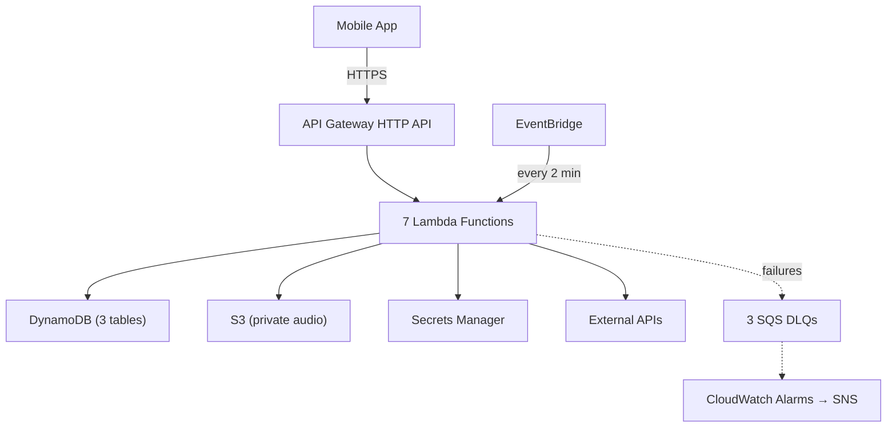

# Ghost Pay — Firebase → AWS Migration Walkthrough

## What Was Done

Migrated the entire Ghost Pay backend from Firebase (Cloud Functions, Firestore, Storage, FCM) to a production-hardened AWS serverless architecture.

### Summary

| Metric | Value |
|---|---|
| Files created | 30 (26 TypeScript + 4 config) |
| TypeScript errors | **0** |
| npm packages | 421 installed |
| Lambda functions | 7 |
| DynamoDB tables | 3 (+ 1 GSI) |
| Firebase dependencies removed | `firebase-admin`, `firebase-functions` |

---

## Architecture



## File-by-File Breakdown

### Infrastructure (template.yaml)

| Resource | Type | Details |
|---|---|---|
| `GhostPayTransactions` | DynamoDB | PK=reference, GSI on status+createdAt, SSE, PITR |
| `GhostPayMerchants` | DynamoDB | PK=merchantId, SSE, PITR |
| `GhostPayIdempotency` | DynamoDB | PK=hash, TTL on `ttl` attribute, SSE, PITR |
| `AudioBucket` | S3 | Private, versioned, AES256 encryption |
| `HttpApi` | API Gateway v2 | CORS, X-Ray tracing |
| 3 SQS DLQs | Dead Letter Queues | 14-day retention |
| 5 CloudWatch Alarms | Monitoring | Error rate, duration, DLQ depth |
| `AlarmTopic` | SNS | Email notifications |

### Utilities Layer

| File | What it does |
|---|---|
| [types.ts](file:///C:/Users/User/Desktop/Personal/Personal%20Studies/Projects/Hackathons/Kora%20Hackathon/ghost-pay-aws/src/types.ts) | All shared interfaces (AudioFile, KoraCharge, TransactionRecord, etc.) |
| [logger.ts](file:///C:/Users/User/Desktop/Personal/Personal%20Studies/Projects/Hackathons/Kora%20Hackathon/ghost-pay-aws/src/utils/logger.ts) | Structured JSON logging with requestId correlation |
| [retry.ts](file:///C:/Users/User/Desktop/Personal/Personal%20Studies/Projects/Hackathons/Kora%20Hackathon/ghost-pay-aws/src/utils/retry.ts) | Exponential backoff with jitter (3 retries, 200ms base) |
| [phone.ts](file:///C:/Users/User/Desktop/Personal/Personal%20Studies/Projects/Hackathons/Kora%20Hackathon/ghost-pay-aws/src/utils/phone.ts) | Nigerian phone normalization (+234 E.164) |
| [speech.ts](file:///C:/Users/User/Desktop/Personal/Personal%20Studies/Projects/Hackathons/Kora%20Hackathon/ghost-pay-aws/src/utils/speech.ts) | Number-to-words for Naira amounts in YarnGPT |

### Database Layer (DynamoDB)

| File | Replaces | Key functions |
|---|---|---|
| [client.ts](file:///C:/Users/User/Desktop/Personal/Personal%20Studies/Projects/Hackathons/Kora%20Hackathon/ghost-pay-aws/src/db/client.ts) | `admin.firestore()` | DynamoDB Document Client singleton |
| [transactions.ts](file:///C:/Users/User/Desktop/Personal/Personal%20Studies/Projects/Hackathons/Kora%20Hackathon/ghost-pay-aws/src/db/transactions.ts) | Firestore transactions collection | create, get, markPaid, markFailed, getPendingBefore (GSI) |
| [merchants.ts](file:///C:/Users/User/Desktop/Personal/Personal%20Studies/Projects/Hackathons/Kora%20Hackathon/ghost-pay-aws/src/db/merchants.ts) | Firestore merchants collection | upsert, get, savePayoutDetails, saveFcmToken |
| [idempotency.ts](file:///C:/Users/User/Desktop/Personal/Personal%20Studies/Projects/Hackathons/Kora%20Hackathon/ghost-pay-aws/src/db/idempotency.ts) | Firestore idempotency collection | getCached (60s window), saveCached (DynamoDB TTL) |

### Services Layer

| File | Replaces | Key change |
|---|---|---|
| [secrets.ts](file:///C:/Users/User/Desktop/Personal/Personal%20Studies/Projects/Hackathons/Kora%20Hackathon/ghost-pay-aws/src/services/secrets.ts) | `process.env` direct access | Secrets Manager with 5-min in-memory cache |
| [storage.ts](file:///C:/Users/User/Desktop/Personal/Personal%20Studies/Projects/Hackathons/Kora%20Hackathon/ghost-pay-aws/src/services/storage.ts) | Firebase Storage `makePublic()` | Private S3 + presigned URLs (15 min) |
| [fcm.ts](file:///C:/Users/User/Desktop/Personal/Personal%20Studies/Projects/Hackathons/Kora%20Hackathon/ghost-pay-aws/src/services/fcm.ts) | `admin.messaging().send()` | Direct FCM HTTP v1 + Google OAuth2 |
| [whisper.ts](file:///C:/Users/User/Desktop/Personal/Personal%20Studies/Projects/Hackathons/Kora%20Hackathon/ghost-pay-aws/src/services/whisper.ts) | Original transcribeAudio | + Secrets Manager + retry |
| [kora.ts](file:///C:/Users/User/Desktop/Personal/Personal%20Studies/Projects/Hackathons/Kora%20Hackathon/ghost-pay-aws/src/services/kora.ts) | Original Kora functions | + retry + resolveBankAccount extracted |
| [whatsapp.ts](file:///C:/Users/User/Desktop/Personal/Personal%20Studies/Projects/Hackathons/Kora%20Hackathon/ghost-pay-aws/src/services/whatsapp.ts) | Original WhatsApp sender | + Secrets Manager JSON secret |
| [yarngpt.ts](file:///C:/Users/User/Desktop/Personal/Personal%20Studies/Projects/Hackathons/Kora%20Hackathon/ghost-pay-aws/src/services/yarngpt.ts) | Original YarnGPT | + retry + Secrets Manager |
| [geminiParser.ts](file:///C:/Users/User/Desktop/Personal/Personal%20Studies/Projects/Hackathons/Kora%20Hackathon/ghost-pay-aws/src/geminiParser.ts) | Original (unchanged logic) | Updated to use Secrets Manager |

### Middleware

| File | Replaces |
|---|---|
| [lambdaAdapter.ts](file:///C:/Users/User/Desktop/Personal/Personal%20Studies/Projects/Hackathons/Kora%20Hackathon/ghost-pay-aws/src/middleware/lambdaAdapter.ts) | Firebase `onRequest` handler signature |
| [auth.ts](file:///C:/Users/User/Desktop/Personal/Personal%20Studies/Projects/Hackathons/Kora%20Hackathon/ghost-pay-aws/src/middleware/auth.ts) | Original requireJwt + getMerchantIdFromRequest |

### Lambda Handlers

| File | Route | Description |
|---|---|---|
| [merchantAuth.ts](file:///C:/Users/User/Desktop/Personal/Personal%20Studies/Projects/Hackathons/Kora%20Hackathon/ghost-pay-aws/src/handlers/merchantAuth.ts) | POST /merchantAuth | Phone-based signup/login → JWT |
| [voiceIngest.ts](file:///C:/Users/User/Desktop/Personal/Personal%20Studies/Projects/Hackathons/Kora%20Hackathon/ghost-pay-aws/src/handlers/voiceIngest.ts) | POST /voiceIngest | Audio → Whisper → Gemini → Kora → WhatsApp |
| [verifyAccount.ts](file:///C:/Users/User/Desktop/Personal/Personal%20Studies/Projects/Hackathons/Kora%20Hackathon/ghost-pay-aws/src/handlers/verifyAccount.ts) | POST /verifyAccount | Bank account verification via Kora |
| [createMerchant.ts](file:///C:/Users/User/Desktop/Personal/Personal%20Studies/Projects/Hackathons/Kora%20Hackathon/ghost-pay-aws/src/handlers/createMerchant.ts) | POST /createMerchant | Save payout bank details |
| [merchantFcm.ts](file:///C:/Users/User/Desktop/Personal/Personal%20Studies/Projects/Hackathons/Kora%20Hackathon/ghost-pay-aws/src/handlers/merchantFcm.ts) | POST /merchantFcm | Store FCM push token |
| [koraWebhook.ts](file:///C:/Users/User/Desktop/Personal/Personal%20Studies/Projects/Hackathons/Kora%20Hackathon/ghost-pay-aws/src/handlers/koraWebhook.ts) | POST /koraWebhook | Payment webhook → voice confirmation |
| [queryCharge.ts](file:///C:/Users/User/Desktop/Personal/Personal%20Studies/Projects/Hackathons/Kora%20Hackathon/ghost-pay-aws/src/handlers/queryCharge.ts) | EventBridge (2 min) | Poll stale pending transactions |

---

## Deployment Guide

### Prerequisites

1. **AWS CLI** — `aws configure` with your access key
2. **AWS SAM CLI** — Install from https://docs.aws.amazon.com/serverless-application-model/latest/developerguide/install-sam-cli.html

### Step 1: Create Secrets in AWS Secrets Manager

```bash
# Run these in your terminal (replace with your actual keys)
aws secretsmanager create-secret --name ghostpay/openai --secret-string "sk-your-openai-key"
aws secretsmanager create-secret --name ghostpay/gemini --secret-string "your-gemini-key"
aws secretsmanager create-secret --name ghostpay/yarngpt --secret-string "your-yarngpt-key"
aws secretsmanager create-secret --name ghostpay/kora --secret-string "your-kora-secret-key"
aws secretsmanager create-secret --name ghostpay/jwt --secret-string "your-jwt-secret"

# WhatsApp is a JSON secret with both token and phone number ID
aws secretsmanager create-secret --name ghostpay/whatsapp --secret-string '{"token":"your-whatsapp-token","phoneNumberId":"your-phone-id"}'

# Google Service Account for FCM (download JSON from Google Cloud Console)
aws secretsmanager create-secret --name ghostpay/google-sa --secret-string file://path/to/service-account.json
```

### Step 2: Build

```bash
cd ghost-pay-aws
sam build
```

### Step 3: Deploy (First Time)

```bash
sam deploy --guided
```

This will ask you:
- Stack name: `ghost-pay-serverless` (pre-configured)
- Region: `us-east-1` (pre-configured)
- Parameters: Fill in `AlarmEmail` and `WhatsAppPhoneNumberId`
- Confirm changeset: Yes

### Step 4: Note Your API URL

After deploy, the output will show:
```
ApiUrl: https://abc123xyz.execute-api.us-east-1.amazonaws.com
```

### Step 5: Update Kora Webhook URL

```bash
sam deploy --parameter-overrides KoraWebhookUrl=https://abc123xyz.execute-api.us-east-1.amazonaws.com/koraWebhook
```

### Step 6: Update Mobile App

Give Dev A the new base URL:
```
https://abc123xyz.execute-api.us-east-1.amazonaws.com
```

All endpoints are at the same base URL — no more Ngrok!

---

## What's Different for Dev A (Mobile App)

| Before (Firebase) | After (AWS) |
|---|---|
| Ngrok URL (changes on restart) | Permanent API Gateway URL |
| `http://ngrok-url/us-central1-merchantAuth` | `https://api-url/merchantAuth` |
| Audio URLs: `https://storage.googleapis.com/...` | Audio URLs: presigned S3 (15 min expiry) |
| Everything else unchanged | Same JWT auth, same request/response format |

---

## Verification Results

- ✅ TypeScript compiles with **0 errors**
- ✅ All 26 source files created
- ✅ 421 npm packages installed
- ✅ SAM template defines all AWS resources
- ⏳ SAM build + deploy — waiting for you to run with your AWS credentials
